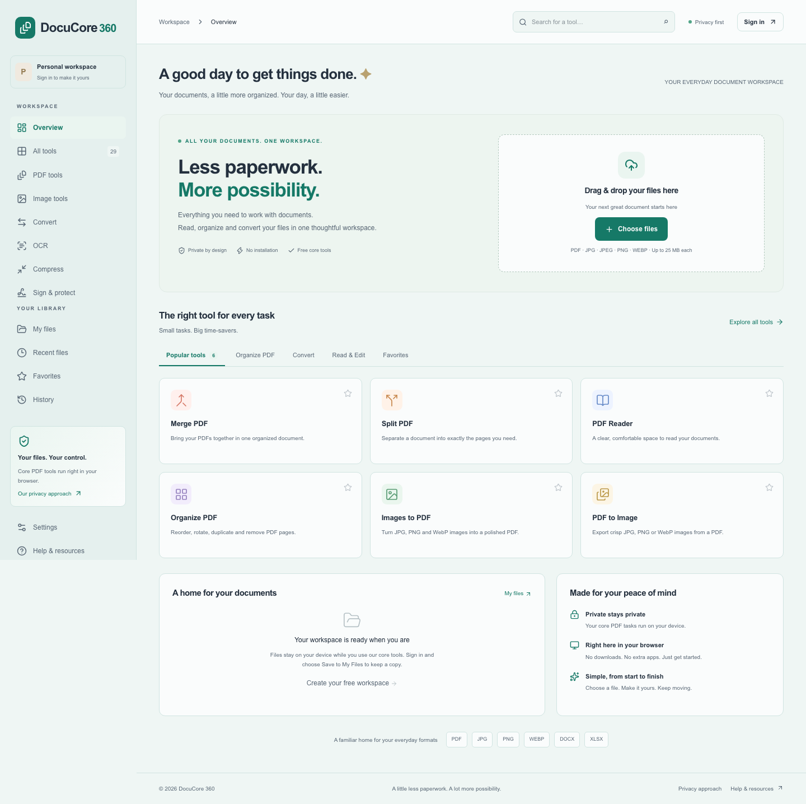
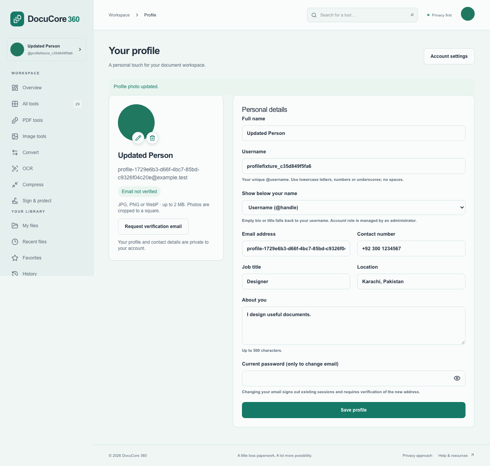
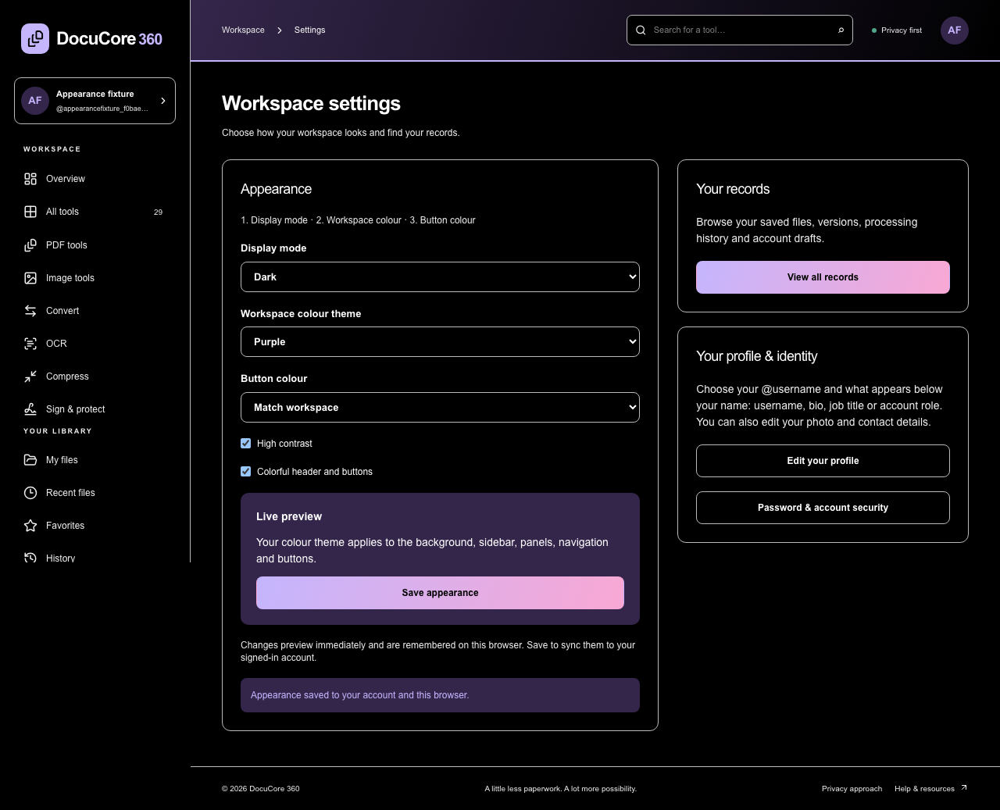
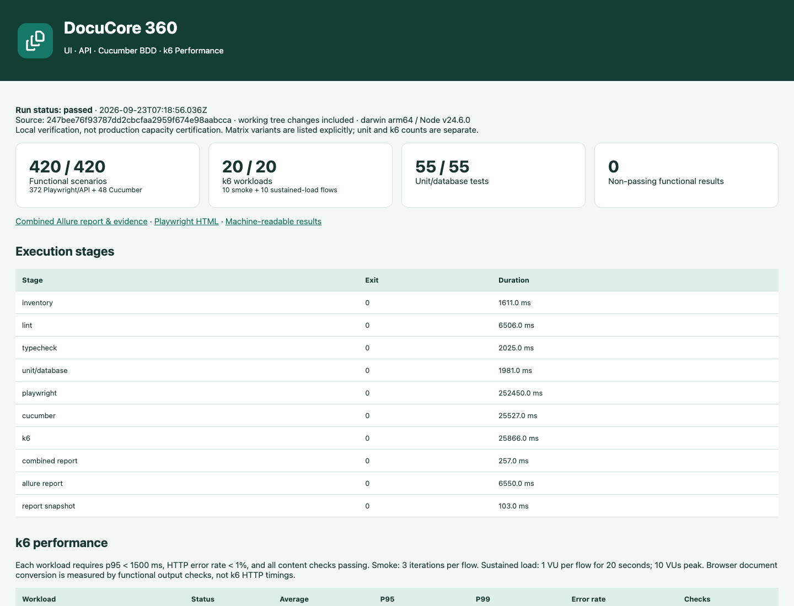
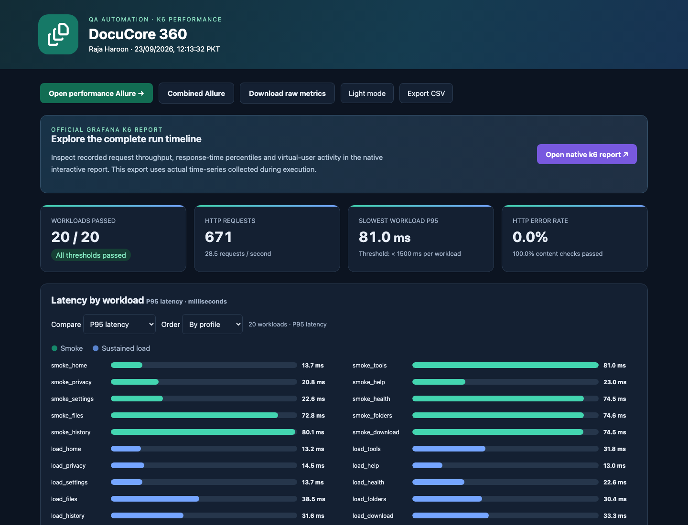

# DocuCore 360

### Your documents. One personal workspace.

DocuCore 360 is a privacy-focused web workspace for working with PDFs, images and everyday documents. Read, combine, annotate, convert and organize files, recognize scanned text, and keep editable projects in a private account—all through one browser interface.

The application includes **29 working tool routes**, a personal file library, account profiles, editable PDF drafts and administrative controls. Most document processing runs on your device. Files are uploaded when you explicitly save a document or account draft; profile-photo upload also stores a private server copy.

[Explore the repository](https://github.com/haroondhanyal/DocuCore360) · [Capabilities](docs/CAPABILITIES.md) · [Deployment](docs/DEPLOYMENT.md) · [Verification](docs/IMPLEMENTATION_STATUS.md)



## Contents

- [Features](#what-you-can-do)
- [Personal profiles](#a-workspace-that-feels-like-you)
- [Typical workflows](#typical-workflows)
- [Local installation](#run-locally)
- [Configuration](#environment-configuration)
- [Local email](#local-email-inbox)
- [Architecture](#architecture)
- [Privacy and limits](#security-and-practical-limits)
- [Complete automation](#complete-automation)
- [Testing and commands](#quality-and-operations)
- [Deployment and backups](#deployment-and-backups)
- [Troubleshooting](#troubleshooting)
- [Documentation](#documentation)

## What you can do

| Workspace           | Capabilities                                                                                            |
| ------------------- | ------------------------------------------------------------------------------------------------------- |
| PDF tools           | Read and search, merge, split, reorder, rotate, duplicate pages, convert images/PDFs and compress       |
| PDF editing         | Text, images, shapes, drawing, highlights, stamps, visual signatures and page operations                |
| Document protection | Multi-region raster redaction, AES-256 protection, password-based unlock and metadata controls          |
| Forms               | Create and place text, checkbox and dropdown fields; fill and flatten supported AcroForms               |
| OCR                 | Recognize English, Urdu, Arabic, Hindi, Spanish, French and German; export text, DOCX or searchable PDF |
| Image studio        | Resize, crop, rotate, adjust colors, draw, add text/image layers and export batches                     |
| Conversion          | Best-effort Word/Excel to PDF, PDF text to Word, text/HTML workflows and editable table extraction      |
| Comparison          | Side-by-side changes in extracted PDF text                                                              |
| Private library     | Search, filters, favorites, nested folders, pagination, versions and downloads                          |
| Editable projects   | Local drafts and private account drafts, optional autosave and revision-conflict protection             |
| Account             | Signup/login, password reset, email verification, profile photo, contact details, bio and appearance    |
| Administration      | Account access management, activity records, database/storage health and cleanup                        |

## A workspace that feels like you

Open the account card at the top of the sidebar to view your name and photo, edit your profile, open settings or sign out.

Your private profile includes your name, unique @username, email, contact number, job title, location and bio. New accounts receive a generated handle, and existing accounts receive unique handles during migration. Edit your handle in Profile using 3–48 lowercase letters, digits or underscores; duplicate handles are rejected. **Show below your name** chooses username, bio, job title or account role for the sidebar. Empty bio/title falls back to the handle; displaying a role does not change permissions. Use the pencil and delete icons directly on your photo to replace or remove a JPG, PNG or WebP avatar; the app creates a square avatar and updates the sidebar and header. Email changes require your current password, revoke existing sessions and clear verification until the new address is verified.

Workspace **Settings** (`/settings`) has a simple **Display mode → Workspace colour theme → Button colour** flow. Display modes are System, Light, Dark, Dim, Midnight black and Sepia. Eight full workspace palettes colour the background, sidebar, panels and controls: Emerald, Blue, Purple, Rose, Red, Orange, Teal and Gray. Button colour can match the workspace or use a custom colour picker, with automatic black/white button text for readability. High contrast and colourful header/buttons are independent options. Changes preview immediately and persist in this browser; **Save appearance** also saves them to your signed-in account for another browser or device.

Personal **Account settings** (`/profile/settings`) is available from the sidebar profile menu and profile page. Change your password there; a successful change ends existing sessions and asks you to sign in again. Every password input—including login, signup, reset, account confirmation and protected PDF tools—has an accessible show/hide eye button.

Use **Settings → View all records** (`/records`) to browse your own saved files and versions, processing history and account drafts. The existing library pagination and history limits still apply: files load 50 per page, history shows the latest 200 records, and an account can retain up to 20 editable drafts.

**All tools** in the sidebar displays all 29 tools. PDF tools, Image tools, Convert, OCR and Sign & protect display their matching tools; the selected category stays in sync with the URL and browser back/forward navigation.

**Our privacy approach** (`/privacy`) explains browser processing, explicit uploads, account data and retention. **Help & resources** (`/help`) is a separate page for tool guidance, limits and troubleshooting.

Core document tools can be used without an account; saved files, account drafts and profiles require sign-in.





## Typical workflows

### Edit and keep a PDF project

1. Open **All tools → Edit PDF** and choose a document.
2. Add text, images, drawings, annotations or a visual signature. Arrange pages as needed.
3. Export a PDF to download the result. Exported annotations are flattened; the editable project is a separate draft.
4. To resume editing later, sign in and choose **Save account draft**. Enable **Autosave to account** after the first explicit save if desired.
5. On a later visit, choose the saved project and select **Restore account draft**. Revision checks reject conflicting saves from another session.

A browser-local draft is stored in that browser profile. An account draft is stored by the configured app server and is available wherever that same deployment is accessible. Neither is a replacement for an offsite backup.

### Organize saved documents

1. Process a document and choose **Save to My Files** when you want to retain a server copy.
2. Use **My files** to search, filter, sort, favorite or move files into folders.
3. Save a compatible result as a new version of an existing file to preserve the previous saved bytes.
4. Open the file's version actions to download or restore a snapshot. There are up to 20 versions per file; saved-file lists use 50-record pages.

### Recognize a scan

1. Open **OCR**, select a PDF or supported images and choose the recognition language.
2. Run recognition and review the extracted text before using it.
3. Export editable text, a DOCX or a searchable PDF. Searchable output keeps an image of the page with an approximate text layer.

Editing extracted text does not recalculate the original OCR word positions. Recognition quality depends on resolution, orientation, handwriting and the source language.

### Reset a password

1. Select **Forgot password?** on the login page and enter the registered email address.
2. Open the reset message in the configured inbox. For local testing, this is Mailpit at `http://localhost:8025`.
3. Follow the link and enter a new password. Links expire after 30 minutes and can be used once.
4. Sign in again. Resetting the password revokes existing sessions.

Verification emails can be requested from your profile. Email verification is available but is not currently a requirement for signing in. No verification message is automatically sent at signup.

## Run locally

Requirements: **Node.js 24**, npm and **PostgreSQL 16+**. Docker is optional for the app and used by the supplied local email inbox.

```sh
git clone https://github.com/haroondhanyal/DocuCore360.git
cd DocuCore360
npm ci
cp .env.example .env
# Set DATABASE_URL and APP_URL in .env.
npm run db:generate
npm run db:deploy
npm run dev
```

`DATABASE_URL` must point to an existing database that your application role can access. The repository does not include the original development machine's database or credentials. `npm run db:deploy` applies the checked-in migrations; it does not provision a PostgreSQL server.

For a fresh database on an existing PostgreSQL server, an administrator can run the following example, replacing the placeholder password:

```sql
CREATE ROLE docucore_app LOGIN PASSWORD 'replace-with-a-strong-password';
CREATE DATABASE docucore360 OWNER docucore_app;
```

Set the connection string in your private `.env`. URL-encode special characters in the database password. On Windows PowerShell, use `Copy-Item .env.example .env` instead of `cp` if needed.

Open **http://localhost:3000** and create an account. There is no shared demo password. An administrator can be created with the optional seed variables described in the [development guide](docs/DEVELOPMENT.md).

For a production build on your machine:

```sh
npm run build
npm start
```

On the already-configured development machine, the dedicated PostgreSQL cluster can be started with `npm run db:local:start` if needed. Do not run development database commands against production.

## Environment configuration

Start with `.env.example`. Keep your actual `.env` private; it is excluded from Git.

| Variable                                  | Purpose                                                                               |
| ----------------------------------------- | ------------------------------------------------------------------------------------- |
| `DATABASE_URL`                            | PostgreSQL connection string for accounts, metadata and sessions                      |
| `APP_URL`                                 | Exact public app origin, including port locally; used by write checks and email links |
| `STORAGE_ROOT`                            | Private binary storage directory; defaults to `./storage`                             |
| `MAX_UPLOAD_MB`                           | Server upload cap, within the application's current 25 MB document limit              |
| `TEMP_FILE_RETENTION_MINUTES`             | Reserved temporary-processing retention setting; does not expire saved files          |
| `SMTP_HOST`, `SMTP_PORT`                  | SMTP server and port for reset/verification mail                                      |
| `SMTP_FROM`                               | Sender address displayed in account emails                                            |
| `SMTP_USER`, `SMTP_PASSWORD`              | Provider credentials where authentication is required                                 |
| `SMTP_SECURE`                             | Enable implicit SMTP TLS; see the deployment guide for transport settings             |
| `SMTP_ALLOW_INSECURE`                     | Local catcher only; keep false for production                                         |
| `SEED_ADMIN_EMAIL`, `SEED_ADMIN_PASSWORD` | Optional, explicit administrator seed credentials                                     |

Restart the app after changing environment values. When changing a local port, update both `APP_URL` and the port used by Next.js so email links and same-origin checks agree.

### Administrator setup

Set both seed variables in the private environment file, then run:

```sh
npm run db:seed
```

The seed password must contain at least 14 characters. No administrator is created when the variables are missing. Seeding does not reset an existing account's password or promote an existing ordinary account; choose a new administrator address for the initial seed. Admin users can access **Administration** and **Command center** from the sidebar.

### Local email inbox

```sh
# Requires Docker Desktop
npm run mail:local:start
```

For an app running directly on your machine, set:

```dotenv
SMTP_HOST="127.0.0.1"
SMTP_PORT="1025"
SMTP_FROM="DocuCore 360 <noreply@docucore.test>"
SMTP_SECURE="false"
SMTP_USER=""
SMTP_PASSWORD=""
SMTP_ALLOW_INSECURE="true"
```

Restart the app, then request a reset or verification email. Stop the catcher with `npm run mail:local:stop`; its inbox volume is retained. Mailpit is a development inbox, not a public email provider.

Open **http://localhost:8025**. With the [local SMTP environment settings](docs/DEPLOYMENT.md#local-email-inbox-mailpit), password reset and verification messages arrive in this inbox. They are not forwarded to Gmail. Real email delivery requires a configured SMTP provider.

## Architecture

```text
Browser UI + document workers
          │ explicit account/file actions
          ▼
Next.js API + authentication
          ├── PostgreSQL / Prisma: accounts, metadata, revisions, history
          └── Private storage: files, versions, editable drafts, profile photos
```

Built with **Next.js, React, TypeScript, Tailwind CSS, Prisma and PostgreSQL**. Document workflows use PDF.js, pdf-lib, Fabric.js, Tesseract, browser canvas and dedicated workers. No desktop Office installation or paid conversion API is required.

### Main technologies

| Technology                      | Role                                                           |
| ------------------------------- | -------------------------------------------------------------- |
| Next.js / React / TypeScript    | App routes, interactive interface and typed API code           |
| Tailwind CSS / Radix primitives | Responsive styling, appearance modes and dialogs               |
| Prisma / PostgreSQL             | Accounts, sessions, folders, draft revisions and file metadata |
| PDF.js / pdf-lib                | PDF rendering, text extraction, page operations and export     |
| Fabric.js / browser canvas      | Editable overlays, image layers, shapes and drawing            |
| Tesseract.js                    | Local OCR with self-hosted language assets                     |
| Mammoth / ExcelJS / docx        | Supported Word and spreadsheet import/export workflows         |
| qpdf WASM via pdfstudio         | PDF password protection and unlock                             |
| Sharp                           | Bounded server-side image validation and avatar normalization  |
| Nodemailer / Mailpit            | SMTP delivery and local email capture                          |
| Vitest / Playwright / axe-core  | Unit, database, browser and accessibility checks               |

Processing workers, OCR data, PDF assets and supported fonts are served by the app rather than fetched from a third-party CDN during document processing. `npm ci` runs the asset-copy postinstall scripts.

### Repository layout

```text
src/app/              Pages, layouts and authenticated API routes
src/components/       Workspace, PDF/image tools, profile and shared UI
src/config/           Central tool registry
src/lib/              Document operations, validation and browser adapters
src/server/           Auth, persistence, private storage and services
src/workers/          Background PDF, Office and security processing
prisma/               Schema, additive migrations and administrator seed
public/fonts/         Bundled fonts and their license
scripts/              Asset setup, cleanup, backup and restore verification
storage/              Private runtime files; only empty placeholders are tracked
tests/                Unit, database integration and browser workflows
deploy/               Docker Compose, Caddy and local SMTP configuration
docs/                 Capabilities, operations, release evidence and screenshots
```

## Security and practical limits

- Password hashing, hashed session/reset tokens, ownership checks, same-origin write checks and shared database rate limits protect account operations.
- Private documents and profile photos are stored outside the public web directory. Photo uploads are bounded, decoded and re-encoded before storage.
- Profile photos are limited to 2 MB; ordinary document inputs are generally limited to 25 MB. Individual workflows have additional page, image and memory limits.
- Office layout reconstruction, OCR, table extraction and text replacement are best effort. Review important output before use.
- Editor whiteout is a visual mask; permanent redaction is a separate raster workflow. Visual signatures are not certificate-based digital signatures.
- Cloud/account drafts use the configured server storage. Running on localhost does not make the app publicly hosted.

See the [capability matrix](docs/CAPABILITIES.md) for exact boundaries.

## Complete automation

DocuCore includes a separate **420-scenario functional automation framework**, plus **20 k6 performance workloads** and the existing **55 unit/database tests**. It follows the UI/API/BDD/report separation used in LedgerMate360.

- **372 Playwright/API cases:** responsive tools, search/favourites, accessibility, custom colours, account/security validation and real document exports, including the original 37 regression journeys.
- **48 Cucumber scenarios:** executable Given/When/Then coverage across six display modes and eight workspace palettes.
- **20 native k6 workloads:** public and authenticated smoke/load checks with latency, error-rate and content thresholds.
- **One combined dashboard and Allure report:** scenario outcomes, steps, screenshots, videos, traces and performance metrics, with separate layer counts.

```bash
npm run automation:complete
npm run automation:open
```

Open **http://localhost:4173** after the run. See the [full setup and reporting guide](docs/automation/README.md), [420-case inventory](docs/automation/SCENARIOS.md) and [sanitized latest report](docs/automation/latest/index.html). GitHub Actions runs the same workflow with disposable PostgreSQL/Mailpit and retains report artifacts. Local performance results are bounded smoke/load measurements, not a production capacity guarantee.





The Allure overview includes **Raja Haroon · QA Automation**, project/run date and DocuCore branding. Suites and categories separate **UI, APIs, BDD, Performance and Unit / Database**. Open the k6 link for a performance dashboard with dark/light mode, P95/P99/average comparison, sorting, smoke/load filters, CSV export and summary cards. The **Open native k6 report** link opens Grafana k6’s official interactive time-series export from the same test run. Its **Open performance Allure** button opens a dedicated branded report containing only the 20 k6 workloads. Native browser screenshots/videos/traces and framework hooks remain attached; API/load cases include execution or threshold evidence rather than browser recordings. History is retained across complete runs for status, duration, retries and category trends.

## Quality and operations

```sh
npm run lint
npm run typecheck
npm test
npm run build
npm run test:e2e
```

Browser tests use synthetic accounts and inspect actual exported files. The [verification report](docs/IMPLEMENTATION_STATUS.md) records completed checks and limitations; it does not treat local checks as production capacity testing.

Deployment assets include Docker, Compose, Caddy/TLS configuration, production migrations, health checks, a cleanup scheduler, and backup/restore scripts. Hosting, DNS, SMTP credentials and offsite backup policies remain deployment configuration.

### Useful commands

| Command                                                | Purpose                                                           |
| ------------------------------------------------------ | ----------------------------------------------------------------- |
| `npm run dev`                                          | Start the development server                                      |
| `npm run build`                                        | Generate the Prisma client and compile a production build         |
| `npm start`                                            | Run the compiled application                                      |
| `npm run db:generate`                                  | Regenerate the Prisma client after schema changes                 |
| `npm run db:deploy`                                    | Apply existing migrations                                         |
| `npm run db:migrate`                                   | Create/apply migrations during development                        |
| `npm run db:seed`                                      | Create an explicitly configured administrator                     |
| `npm run lint` / `npm run typecheck`                   | Check code quality and TypeScript                                 |
| `npm test`                                             | Run unit/database tests; database tests require a test connection |
| `npm run test:e2e`                                     | Run Chromium workflows against the app                            |
| `npm run mail:local:start` / `npm run mail:local:stop` | Start/stop the local email inbox                                  |
| `npm run storage:cleanup`                              | One expired-record cleanup pass                                   |
| `npm run storage:schedule`                             | Run cleanup periodically                                          |
| `npm run backup -- --quiesced`                         | Back up the database and matching storage after stopping writers  |
| `npm run backup:verify -- backups/TIMESTAMP`           | Check hashes and restore into a disposable database               |

Install Chromium once before the browser suite:

```sh
npx playwright install chromium
npm run build
npm run test:e2e
```

The local email browser test is opt-in and requires the app to use the local SMTP configuration:

```sh
LOCAL_MAIL_TEST=1 npm run test:e2e
```

On PowerShell, set `$env:LOCAL_MAIL_TEST="1"` before running the test command. Use a dedicated test database: these suites create and delete synthetic accounts and files.

**Recorded local verification (23 September 2026):** all 420 functional scenarios (372 Playwright/API + 48 Cucumber), 20 k6 workloads and 55 unit/database tests passed in one complete run, along with lint, TypeScript and the production build. Allure contains 495 passing checks across these separate layers. The [latest sanitized results](docs/automation/latest/results.json) preserve the tested source fingerprint and stage outcomes. A WebKit PDF merge smoke test also passed in prior verification. Firefox verification remains incomplete because of a browser-profile startup issue; a full cross-browser pass is not claimed.

## Deployment and backups

The supplied single-host Compose setup includes PostgreSQL, a one-off migration service, the application, a cleanup scheduler and a Caddy HTTPS reverse proxy. It uses persistent volumes for database and document storage.

```sh
cp deploy/.env.example deploy/.env
# Set DOMAIN, APP_URL, POSTGRES_PASSWORD and any SMTP values.
docker compose --env-file deploy/.env -f deploy/compose.yaml up --build -d
```

Use a hostname pointing to the deployment server and make ports 80/443 reachable for the proxy. The Compose example requires a long random alphanumeric database password to avoid connection-string interpolation issues. Check `/api/health` after startup, then exercise registration and a synthetic save/download flow.

For consistent backups, stop application and scheduler writes first, leave PostgreSQL running, and capture both the database and matching storage. Backup scripts require compatible PostgreSQL client tools; those utilities are not included in the application Docker image. Restore verification creates and removes a separate temporary database and requires database-creation privileges for that verification role.

See the [deployment guide](docs/DEPLOYMENT.md) for TLS, storage, SMTP, backup and recovery details. Real Gmail delivery, public hosting and offsite backup policies are not configured by cloning this repository.

## Troubleshooting

| Symptom                                                | What to check                                                                                                                         |
| ------------------------------------------------------ | ------------------------------------------------------------------------------------------------------------------------------------- |
| Database connection fails or `/api/health` returns 503 | Confirm PostgreSQL is running, `DATABASE_URL` is correct, migrations are applied and the storage directory is writable                |
| `db:local:start` fails after cloning                   | That helper only starts the original machine's existing `.local-postgres` cluster; provision your own database for a new installation |
| A write is rejected because of its origin              | Match `APP_URL` to the exact browser origin, including `localhost` versus `127.0.0.1`, scheme and port                                |
| Port 3000 is already occupied                          | Stop the intended app process or choose another port and update `APP_URL`; do not terminate unrelated services                        |
| No reset/verification email arrives                    | Check SMTP settings and restart the app; local messages appear in Mailpit, not Gmail. Verification must be requested from the profile |
| Reset link is invalid or expired                       | Request a new link; links are single-use, expire after 30 minutes and can be invalidated by a newer request or account change         |
| Uploaded photo is rejected                             | Use a valid JPG/PNG/WebP under 2 MB and within the 16-megapixel limit; animated images are not accepted                               |
| OCR or PDF worker assets fail to load                  | Run `npm run postinstall`, rebuild and restart; generated asset folders are intentionally not committed                               |
| An account draft reports a conflict                    | Restore/review the latest account draft before saving again, or save a separate copy                                                  |
| Large conversions stop or exceed memory limits         | Try fewer pages, smaller images or lower resolution; browser memory and workflow limits still apply                                   |
| Export looks different from the source                 | Check the documented best-effort limits for Office layout, fonts, OCR and raster reconstruction                                       |
| `npm start` cannot find a build                        | Run `npm run build` successfully before starting the production server                                                                |

## Reporting issues and making changes

Include the affected tool, browser, reproduction steps and expected versus actual behavior. Use a small synthetic document when reporting a conversion problem; avoid attaching private documents or credentials. Explain whether the issue happens in development or a production build.

Before submitting code changes, run the checks relevant to the affected workflow, preserve ownership and explicit-save boundaries, and update the capability documentation if behavior or limits change. Dependency versions are locked in `package-lock.json`; use `npm ci` for reproducible installs.

## Documentation

- [Development setup and command reference](docs/DEVELOPMENT.md)
- [Deployment, local email and backup operations](docs/DEPLOYMENT.md)
- [Capability matrix](docs/CAPABILITIES.md)
- [Architecture](docs/ARCHITECTURE.md)
- [Release 0.4 details](docs/RELEASE_0_4.md)
- [Implementation and test status](docs/IMPLEMENTATION_STATUS.md)
- [Project description](docs/PROJECT_DESCRIPTION.md)
