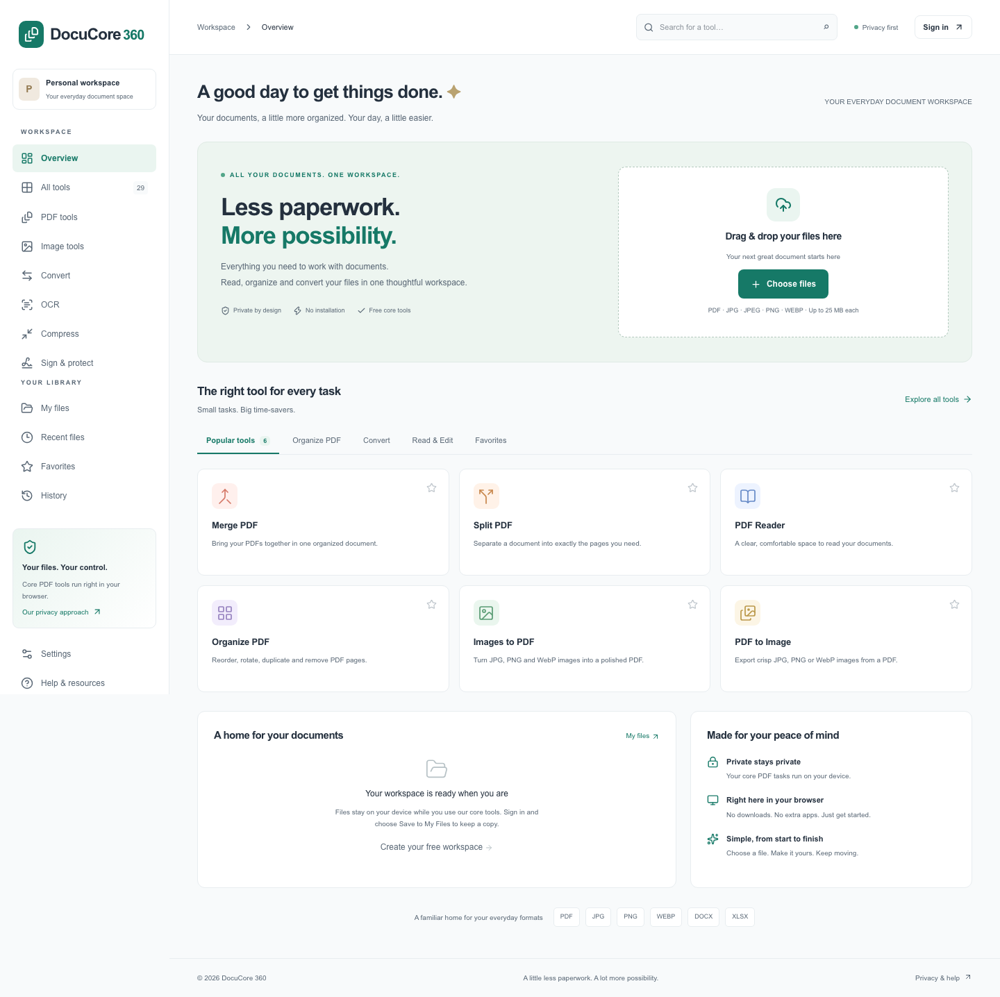

# DocuCore 360

### Your documents. One personal workspace.

DocuCore 360 is a privacy-focused web workspace for working with PDFs, images and everyday documents. Read, combine, annotate, convert and organize files, recognize scanned text, and keep editable projects in a private account—all through one browser interface.

The application includes **29 working tool routes**, a personal file library, account profiles, editable PDF drafts and administrative controls. Most document processing runs on your device. Files are uploaded when you explicitly save a document or account draft; profile-photo upload also stores a private server copy.

[Explore the repository](https://github.com/haroondhanyal/DocuCore360) · [Capabilities](docs/CAPABILITIES.md) · [Deployment](docs/DEPLOYMENT.md) · [Verification](docs/IMPLEMENTATION_STATUS.md)



## What you can do

| Workspace           | Capabilities                                                                                            |
| ------------------- | ------------------------------------------------------------------------------------------------------- |
| PDF tools           | Read and search, merge, split, reorder, rotate, duplicate pages, convert images/PDFs and compress       |
| PDF editing         | Text, images, shapes, drawing, highlights, stamps, visual signatures and page operations                |
| Document protection | Multi-region raster redaction, AES-256 protection, password-based unlock and metadata controls          |
| Forms               | Create and place text, checkbox and dropdown fields; fill and flatten supported AcroForms               |
| OCR                 | Recognize English, Urdu, Arabic, Hindi, Spanish, French and German; export text, DOCX or searchable PDF |
| Image studio        | Resize, crop, rotate, adjust colors, draw, add text/image layers and export batches                     |
| Conversion          | Best-effort Word/Excel to PDF, PDF text to Word, text/HTML workflows and editable table extraction      |
| Comparison          | Side-by-side changes in extracted PDF text                                                              |
| Private library     | Search, filters, favorites, nested folders, pagination, versions and downloads                          |
| Editable projects   | Local drafts and private account drafts, optional autosave and revision-conflict protection             |
| Account             | Signup/login, password reset, email verification, profile photo, contact details, bio and appearance    |
| Administration      | Account access management, activity records, database/storage health and cleanup                        |

## A workspace that feels like you

Open the account card at the top of the sidebar to view your name and photo, edit your profile, open settings or sign out.

Your private profile includes your name, email, contact number, job title, location and bio. Upload or remove a JPG, PNG or WebP photo; the app creates a square avatar and updates the sidebar. Email changes require your current password, revoke existing sessions and clear verification until the new address is verified.

Light, dark and system appearance modes are available in Settings. Core document tools can be used without an account; saved files, account drafts and profiles require sign-in.

## Run locally

Requirements: **Node.js 24**, npm and **PostgreSQL 16+**. Docker is optional for the app and used by the supplied local email inbox.

```sh
npm ci
cp .env.example .env
# Set DATABASE_URL and APP_URL in .env.
npm run db:generate
npm run db:deploy
npm run dev
```

Open **http://localhost:3000** and create an account. There is no shared demo password. An administrator can be created with the optional seed variables described in the [development guide](docs/DEVELOPMENT.md).

For a production build on your machine:

```sh
npm run build
npm start
```

On the already-configured development machine, the dedicated PostgreSQL cluster can be started with `npm run db:local:start` if needed. Do not run development database commands against production.

### Local email inbox

```sh
# Requires Docker Desktop
npm run mail:local:start
```

Open **http://localhost:8025**. With the [local SMTP environment settings](docs/DEPLOYMENT.md#local-email-inbox-mailpit), password reset and verification messages arrive in this inbox. They are not forwarded to Gmail. Real email delivery requires a configured SMTP provider.

## Architecture

```text
Browser UI + document workers
          │ explicit account/file actions
          ▼
Next.js API + authentication
          ├── PostgreSQL / Prisma: accounts, metadata, revisions, history
          └── Private storage: files, versions, editable drafts, profile photos
```

Built with **Next.js, React, TypeScript, Tailwind CSS, Prisma and PostgreSQL**. Document workflows use PDF.js, pdf-lib, Fabric.js, Tesseract, browser canvas and dedicated workers. No desktop Office installation or paid conversion API is required.

## Security and practical limits

- Password hashing, hashed session/reset tokens, ownership checks, same-origin write checks and shared database rate limits protect account operations.
- Private documents and profile photos are stored outside the public web directory. Photo uploads are bounded, decoded and re-encoded before storage.
- Profile photos are limited to 2 MB; ordinary document inputs are generally limited to 25 MB. Individual workflows have additional page, image and memory limits.
- Office layout reconstruction, OCR, table extraction and text replacement are best effort. Review important output before use.
- Editor whiteout is a visual mask; permanent redaction is a separate raster workflow. Visual signatures are not certificate-based digital signatures.
- Cloud/account drafts use the configured server storage. Running on localhost does not make the app publicly hosted.

See the [capability matrix](docs/CAPABILITIES.md) for exact boundaries.

## Quality and operations

```sh
npm run lint
npm run typecheck
npm test
npm run build
npm run test:e2e
```

Browser tests use synthetic accounts and inspect actual exported files. The [verification report](docs/IMPLEMENTATION_STATUS.md) records completed checks and limitations; it does not treat local checks as production capacity testing.

Deployment assets include Docker, Compose, Caddy/TLS configuration, production migrations, health checks, a cleanup scheduler, and backup/restore scripts. Hosting, DNS, SMTP credentials and offsite backup policies remain deployment configuration.

## Documentation

- [Development setup and command reference](docs/DEVELOPMENT.md)
- [Deployment, local email and backup operations](docs/DEPLOYMENT.md)
- [Capability matrix](docs/CAPABILITIES.md)
- [Architecture](docs/ARCHITECTURE.md)
- [Release 0.4 details](docs/RELEASE_0_4.md)
- [Implementation and test status](docs/IMPLEMENTATION_STATUS.md)
- [Project description](docs/PROJECT_DESCRIPTION.md)
