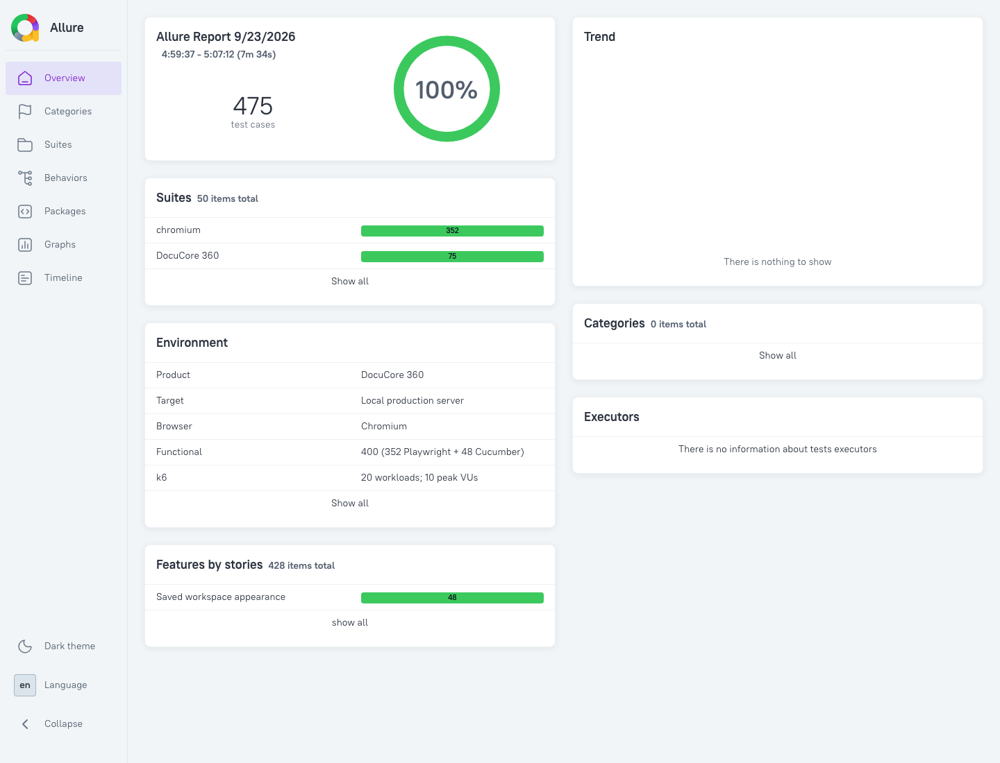

# DocuCore 360 automation

A separate, repeatable automation workflow for the document workspace. The structure follows the UI/API/BDD/performance separation in [LedgerMate360](https://github.com/haroondhanyal/LedgerMate360), adapted to DocuCore's real tools, account boundaries and local document processing.

## Coverage and counting

**400 functional scenarios** are inventoried before execution. Matrix variants are explicit: a different viewport, document input, display/palette combination or negative request is a separate scenario. These are not 400 distinct product features.

| Area                            |   Cases | What is asserted                                                                                                                          |
| ------------------------------- | ------: | ----------------------------------------------------------------------------------------------------------------------------------------- |
| Existing end-to-end regressions |      37 | Real PDF/Office/image exports, OCR, editing, authentication, reset emails, profile photos, drafts, versions, folders and admin boundaries |
| Responsive tool screens         |      87 | 29 tools × desktop/tablet/mobile: input availability, heading, overflow, return navigation and browser timing                             |
| Search and favourites           |      58 | Each of 29 tools: search/open and favourite/reload/remove lifecycle                                                                       |
| Custom button colours           |      16 | 8 colours × light/dark: persisted choice, final text contrast ≥ 4.5:1 and reset                                                           |
| Accessibility                   |      28 | 14 guest screens × light/dark: serious/critical WCAG A/AA checks and keyboard skip navigation                                             |
| Additional document exports     |      37 | 10 merge inputs, 8 split sizes, 8 metadata strings, 6 image format/size combinations and 5 text-to-PDF round trips                        |
| API security                    |      41 | 13 session boundaries and 28 missing/untrusted-origin mutation requests                                                                   |
| API input validation            |      48 | 20 profile, 12 signup, 8 folder and 8 file-upload rejection cases                                                                         |
| Cucumber BDD                    |      48 | 6 display modes × 8 palettes: select, render, reload and restore                                                                          |
| **Functional total**            | **400** | **352 Playwright/API + 48 Cucumber**                                                                                                      |

**20 k6 workloads** and **55 existing unit/database tests** are reported separately. Unit tests are retained because they check document/security logic and database behavior cheaply. They are not added to the functional count.

The [scenario inventory](SCENARIOS.md) and [all 400 IDs](scenario-inventory.json) map coverage to executable sources. `automation:inventory` fails if counts or IDs drift. The 37 existing regression cases receive report IDs without duplicating their execution. The standard `npm run test:e2e` remains the original focused regression entry point.

## One-command complete run

Prerequisites:

- Node.js 24, installed dependencies and Playwright Chromium (`npx playwright install chromium`). Linux CI installs browser system dependencies too.
- PostgreSQL with all migrations applied, writable private storage, and a local app URL of `http://localhost:3000`.
- Mailpit on SMTP port 1025 and HTTP port 8025. Configure the local SMTP values in [the deployment guide](../DEPLOYMENT.md#local-email-inbox-mailpit), then run `npm run mail:local:start`.
- Docker for the pinned `grafana/k6:1.6.1` engine, or `K6_BINARY=/absolute/path/to/k6` to use a native installation.
- Java for Allure generation. On macOS, the runner detects the installed Java if `JAVA_HOME` points to a removed version.

```bash
npm ci
npx playwright install chromium
npm run db:deploy
npm run mail:local:start
npm run automation:complete
npm run automation:open
```

Open **http://localhost:4173** for the branded combined dashboard, then follow links to Allure and Playwright HTML. If port 3000 is not healthy, the complete runner builds and starts a production app, and stops that process when finished. An already running healthy app is reused; rebuild it first after application changes. macOS runs temporarily inhibit idle sleep only for the automation process lifetime.

The complete runner cleans previous raw results, records the source commit, dirty-tree flag and source SHA-256, checks the 400-case inventory, runs lint/TypeScript/unit checks, executes Playwright and Cucumber, runs k6, and generates reports. Later stages still execute after a test failure so the report remains useful. A missing result, skipped/failed/timed-out scenario, failed performance threshold, or failed stage prevents a green complete result and causes a nonzero command exit. No automatic retries are enabled in this automation configuration.

## Independently runnable sections

| Command                          | Scope                                                         |
| -------------------------------- | ------------------------------------------------------------- |
| `npm run automation:inventory`   | Validate/generate the 400-case catalog                        |
| `npm run automation:ui`          | Browser matrices and existing regression journeys (263 cases) |
| `npm run automation:api`         | Focused security/validation matrices (89 cases)               |
| `npm run automation:bdd`         | 48 actual Gherkin/Cucumber scenarios                          |
| `npm run automation:performance` | 20 native k6 engine workloads                                 |
| `npm run automation:report`      | Rebuild the combined dashboard from current raw results       |
| `npm run automation:complete`    | Clean full verification and report publication                |
| `npm run automation:open`        | Serve local reports on loopback port 4173                     |

Individual section runs are diagnostic. They do not constitute a fresh complete pass and do not clear all historical raw Allure data. Use `automation:complete` for a shareable full report. To filter a specific scenario, use `npx playwright test -c playwright.automation.config.ts --grep DC-TEXT-005` or `npx cucumber-js --name 'DC-BDD-001'`.

## BDD and evidence

The executable feature file is [appearance.feature](../../tests/automation/bdd/appearance.feature). It runs through `@cucumber/cucumber`, with real Given/When/Then definitions driving Playwright Chromium. Playwright matrices also expose named behavior steps in their reports.

Playwright captures screenshots, video and traces for browser cases. API-only cases have request/assertion results; they do not fabricate screenshots. Cucumber captures a screenshot, video and trace for every scenario. Accessibility results and browser navigation timing are attached as JSON. Existing document tests parse actual downloaded PDF, ZIP, DOCX, XLSX and image content.

Raw artifacts can contain synthetic session cookies and request data. They stay in ignored `automation-results/` and CI artifacts. Only sanitized summaries and selected screenshots are committed. Synthetic accounts are removed by test teardown; an interrupted process may require inspecting and removing its explicitly prefixed test fixtures.

## Performance workload and limits

The k6 engine executes **10 smoke + 10 sustained-load flows**:

- Public: overview, tools, privacy, help and settings.
- Health: database/storage health endpoint.
- Authenticated: saved files, folders, history and private file download.

Setup creates one synthetic account and saves a small text file with explicit consent. Teardown deletes that account and its file. Every flow checks HTTP 200 and expected content, including private-download cache behavior.

Smoke uses three iterations per flow. Sustained load uses one VU per flow for 20 seconds, with 300 ms think time; ten load VUs run together. k6 allocates up to twenty VUs because smoke and load scenario definitions can overlap if smoke runs slowly. The raw summary records observed concurrency. Thresholds apply independently to each of the twenty workloads:

- HTTP duration p95 below **1,500 ms**.
- HTTP failure rate below **1%**.
- Content checks **100% passing**.

Threshold failures propagate to the command exit and the combined report. This uses [k6 thresholds](https://grafana.com/docs/k6/latest/using-k6/thresholds/) and [custom JSON summaries](https://grafana.com/docs/k6/latest/results-output/end-of-test/custom-summary/). The workload intentionally accepts only localhost, loopback or Docker's host bridge on port 3000.

These are bounded local smoke/load measurements, not production capacity, soak, stress or browser-render benchmarks. Smoke percentiles have only three samples. PDF/OCR/image processing runs client-side, so its correctness and operation durations are covered by browser exports, not the HTTP workload. The responsive matrix attaches DOM-content-loaded/load/response timings and enforces a 15-second DOM-content-loaded smoke budget; this is not a Core Web Vitals certification.

## Reports

| Artifact                       | Location                                                                |
| ------------------------------ | ----------------------------------------------------------------------- |
| Combined branded dashboard     | `automation-results/index.html`                                         |
| Combined Allure, all layers    | `automation-results/allure-report/index.html`                           |
| Playwright HTML and evidence   | `automation-results/playwright-html/index.html`                         |
| Playwright structured results  | `automation-results/playwright.json`, `functional.json`                 |
| Cucumber results/evidence      | `automation-results/cucumber.json`, `bdd-evidence/`                     |
| k6 metrics and thresholds      | `automation-results/k6.json`                                            |
| Unit/database results          | `automation-results/unit.json`                                          |
| Complete run provenance/stages | `automation-results/run.json`                                           |
| Sanitized shareable snapshot   | [latest report](latest/index.html), [results JSON](latest/results.json) |

Allure groups functional, Cucumber, performance and unit results; its total is therefore **475 checks**, while the product's functional inventory remains **400**. Statuses are taken from actual execution. The report never changes failed results to passed for presentation. The snapshot is published only after a complete green run. GitHub renders HTML files as source; download/open the snapshot or use `automation:open` for the interactive dashboard.

## GitHub Actions

[automation.yml](../../.github/workflows/automation.yml) runs on pull requests, pushes to `main` and manual dispatch. It provisions disposable PostgreSQL/Mailpit services, installs Chromium, applies migrations, uses Java for Allure and Docker for k6, and invokes the same complete command. Reports upload even when tests fail, with a 14-day artifact retention. No production secrets or external mail account are needed.

A local pass does not claim the remote GitHub Actions job passed. Check the actual Actions run after pushing.

## Framework layout

```text
tests/automation/specs/       Responsive, discovery, appearance, accessibility, API and export matrices
tests/automation/support/     Shared behavior registration
tests/automation/bdd/         Gherkin feature and executable Cucumber steps
tests/e2e/                    Existing regression flows, page object and generated fixtures
tests/performance/            Pinned-engine k6 workload
scripts/automation/           Inventory, execution, result adapter, dashboard and report server
playwright.automation.config.ts  Separate full-suite browser configuration
cucumber.cjs                  Cucumber/Allure configuration
.github/workflows/automation.yml  CI services and artifacts
docs/automation/              Inventory, instructions and sanitized latest report
```

## Verified report previews

The complete local run on 23 September 2026 passed 400 functional scenarios, 20 k6 workloads and 55 unit/database checks. The combined dashboard search/status filters and the 475-check Allure overview were also opened and verified in Chromium.



